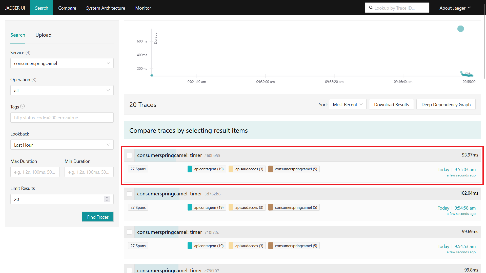
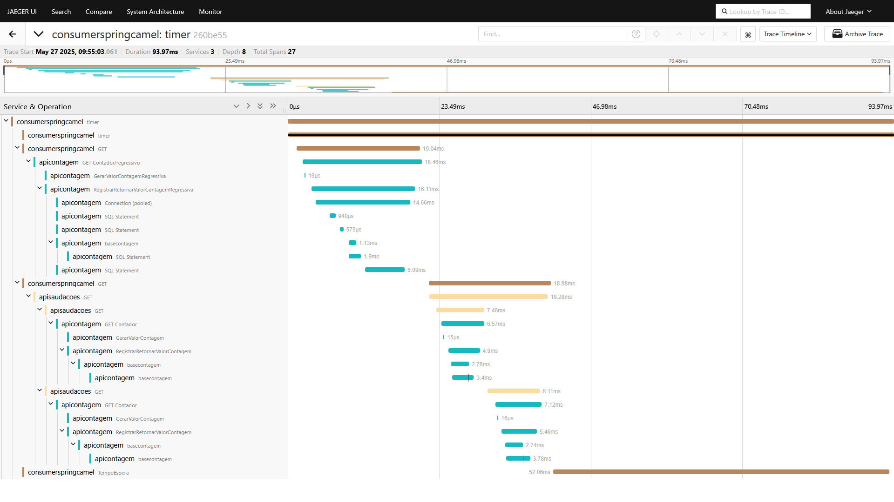

# aspnetcore9-otel-jaeger-postgres-mysql_apicontagem
Exemplo de API REST criada com o .NET 9 + ASP.NET Core e utilizando Distributed Tracing com Jaeger + OpenTelemetry (configurando porta do Collector) + PostgreSQL + MySQL. Inclui o uso de Docker Compose para a subida de ambiente que faz uso do projeto Jaeger e do serviço OpenTelemetry Collector.

Aplicações que consomem este projeto:
- [**Saudações (Node.js)**](https://github.com/renatogroffe/nodejs-otel-jaeger_apisaudacoes)
- [**Consumer das APIs (Java + Spring + Apache Camel)**](https://github.com/renatogroffe/java-spring-camel-otel-jaeger-postgres-mysql_consumoapis)

Traces gerados durante testes no dashboard do Jaeger:

Exemplo de trace demonstrando uma interação entre as 3 aplicações aqui mencionadas:

